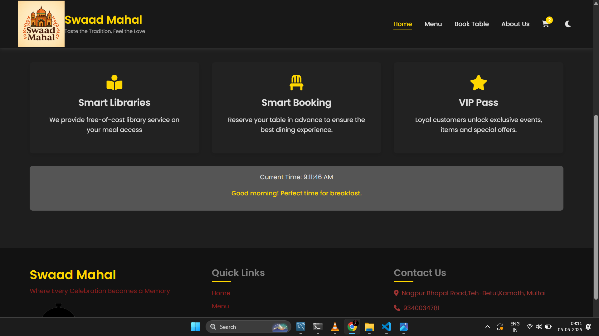
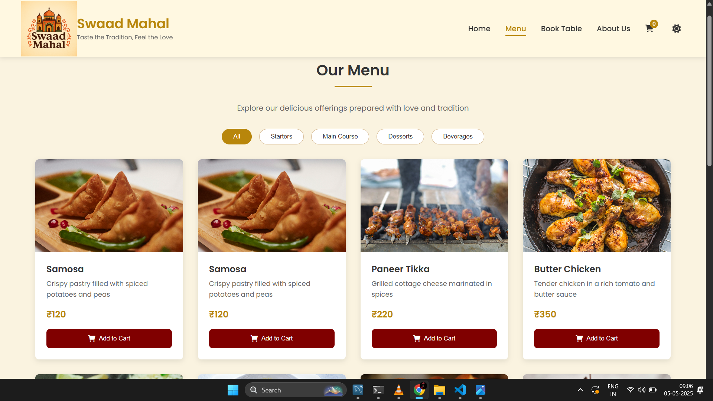
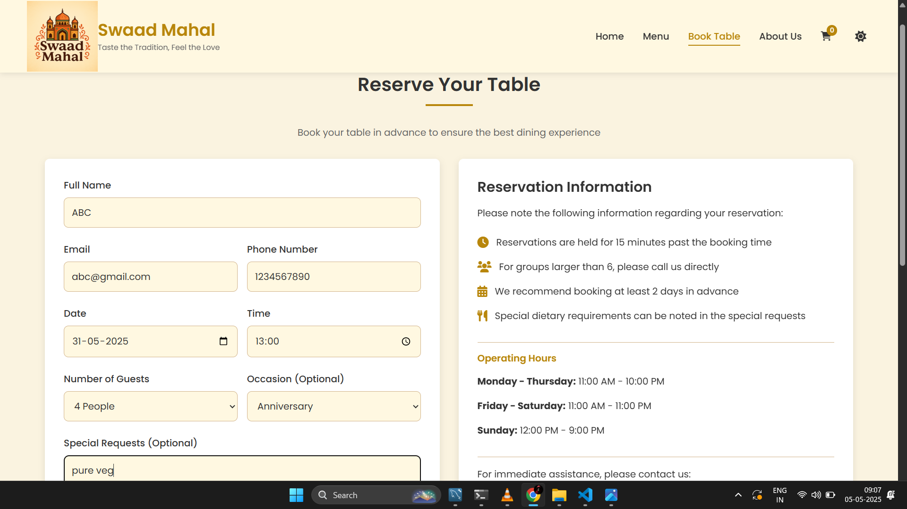
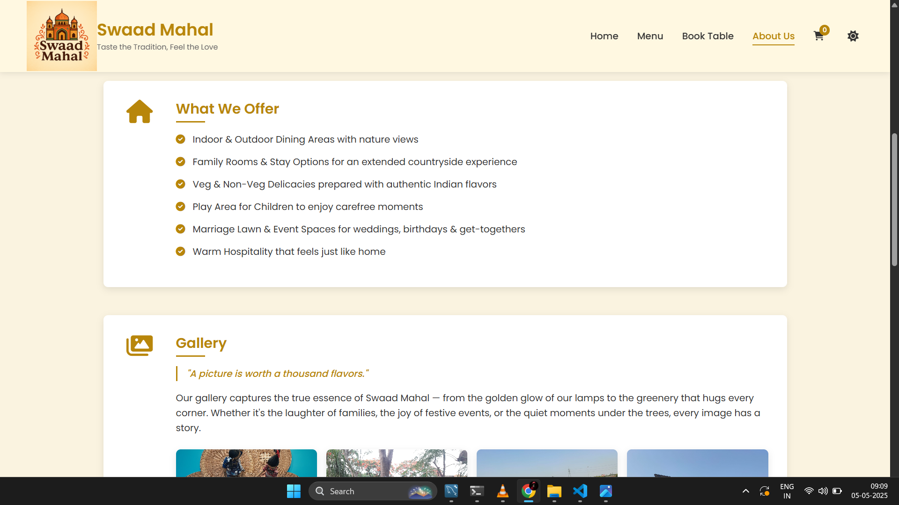
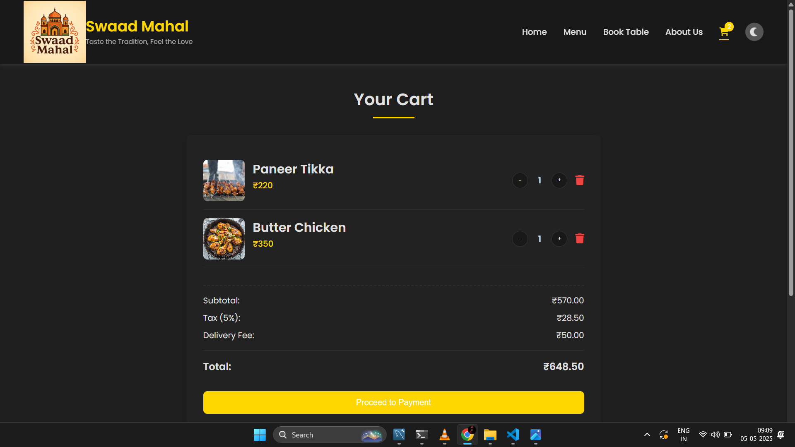

<h1>🌶️ Swaad Mahal - Restaurant Website</h1>

A responsive, interactive website for Swaad Mahal, a traditional Indian restaurant nestled among Saagon trees. It offers a taste of love through authentic Indian cuisine, warm hospitality, and vibrant event spaces.

<h2>📌 Features</h2>

🌐 Responsive Design – Seamlessly adapts to mobile, tablet, and desktop  
🌙 Dark/Light Mode – Toggle between comfortable viewing themes  
🍽️ Interactive Menu – Filterable items (starters, meals, desserts, beverages)  
📅 Table Reservation System – Simple form with local storage for booking  
🛒 Shopping Cart – Add, update, and remove menu items  
🏡 About Us Section – Storytelling through design and words  
🖼️ Image Gallery – Restaurant, food, and ambiance  
💾 Local Storage – Saves reservations, cart, and theme preferences  

<h2>🛠 Technologies Used></h2>

HTML5  
CSS3 (Custom properties for theming)  
JavaScript (Vanilla)  
Font Awesome (icons)  
Google Fonts  
Local Storage API  

<h2>📂 Project Structure</h2>

swaad-mahal/  
├── app.html           # Main HTML structure  
├── app.css            # Styling (responsive + themes)  
├── app.js             # JavaScript for interactivity  
└── assets/            # Media: images, icons, etc.  

<h2>💡 Sections in Detail</h2>

<h3>🏠 Home</h3>
Hero section with call-to-action  
Real-time greeting based on current time  
Feature highlights

<h3>🍛 Menu</h3>
Filterable food items  
Add to cart  
Categories: Starters, Main Course, Desserts, Beverages  

<h3>📖 About Us</h3>
Love of mother and father through food  
Located in a natural Saagon tree environment  
Services: Dining, Rooms, Marriage Lawn, Kids Zone, Small Events  

<h3>📅 Book Table</h3>
Form with date, time, party size, and notes  
View or cancel existing reservations  

<h3>🛒 Cart</h3>
Add/remove/update items  
View total bill  

<h3>📞 Footer</h3>
Quick navigation  
Contact & social media  
Copyright  

<h2>📸 Screenshots</h2>

| Homepage | Menu | Reservation |
|----------|------|-------------|
|  |  |  |

| About Us | Cart |
|----------|------|
|  |  |

<h2>🚀 Getting Started</h2>

Clone the repository:git clone https://github.com/Himanshusable2488/swaad-mahal.git  
cd swaad-mahal  
Open in Browser:  
open app.html  
(or simply double-click app.html in your file manager)  

## 🌐 **Live Demo**
https://himanshusable2488.github.io/SwaadMahal/

<h2>📝 License</h2>

© 2025 Swaad Mahal. All rights reserved.
